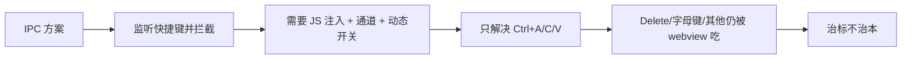

# HTML 节点 WebView 焦点劫持问题 — 修复方案

## 1. 问题描述

HTML 节点使用 wry WebView2 作为子窗口嵌入 Canvas。当前问题：

1. **快捷键被吃掉**：用户选中普通节点后按 Ctrl+C，快捷键被 webview 拦截而不是 Canvas 处理
2. **编辑器无法输入**：用户先点击 HTML 节点 webview，再双击文本节点打开编辑器，键盘输入仍被 webview 拦截
3. **本质**：WebView2 原生 HWND 子窗口劫持了焦点/键盘事件，即使 Canvas 逻辑上需要键盘输入

## 2. 根因分析

### 2.1 wry 创建 WebView2 子窗口的机制

文件：wry-0.55.1/src/webview2/mod.rs

```rust
// 容器窗口创建为 WS_CHILD
let mut window_styles = WS_CHILD | WS_CLIPCHILDREN;

// 容器放在 HWND_TOP，用 SWP_NOACTIVATE 避免激活时抢焦点
SetWindowPos(hwnd, Some(HWND_TOP), 0, 0, 0, 0,
    SWP_ASYNCWINDOWPOS | SWP_NOACTIVATE | ...);

// ⚠️ 关键：容器窗口的默认 WndProc 会把焦点自动转给 WebView2 子控件
unsafe extern "system" fn default_window_proc(hwnd, msg, wparam, lparam) {
    if msg == WM_SETFOCUS {
        let child = GetWindow(hwnd, GW_CHILD).ok();
        if child.is_some() {
            let _ = SetFocus(child); // 焦点 → WebView2
        }
    }
    DefWindowProcW(hwnd, msg, wparam, lparam)
}
```

### 2.2 焦点流向

```
用户在 webview 上点击
  → 容器 HWND 收到 WM_SETFOCUS
    → default_window_proc 把焦点转发给 WebView2 子控件
      → 键盘输入永久归属 WebView2
      
用户点击画布其他区域（egui 渲染层）
  → 父窗口应获得焦点
  → ? 但点击可能被 webview 覆盖区域拦截
  → ? 或焦点转移不完整
```

### 2.3 为什么 IPC 方案（上一版）是错的



## 3. 修复方案

### 3.1 核心思路

**显式焦点管理**：在用户与 Canvas 交互时，主动把焦点从 webview 还给父窗口。

```
用户点击 webview → 焦点归 webview（自然行为，不做干预）
用户点击画布/节点/连线 → return_focus_to_parent() → 焦点归还父窗口 → 键盘归 Canvas
```

### 3.2 两个组件

| 组件 | 作用 |
|------|------|
| `with_browser_accelerator_keys(false)` | webview 永不拦截 Ctrl+A/C/V 等浏览器级快捷键 |
| `HtmlWebViewHost::return_focus_to_parent()` | 用户操作画布时，把焦点从 webview 收回到父窗口 |

两者结合：
- 浏览器加速键 → 始终穿透到父窗口（Canvas 处理）
- 其他键盘输入 → 随焦点归属自然路由：点在 webview 归 webview，点在画布归画布

## 4. 详细修改清单

### 4.1 Cargo.toml — 移除不需要的依赖

当前多余的 `[target.'cfg(target_os = "windows")'.dependencies]` 需要删除，恢复到只依赖 wry。

**当前**：
```toml
wry = { version = "0.55.1", default-features = false, features = ["os-webview", "protocol"] }

[target.'cfg(target_os = "windows")'.dependencies]
webview2-com = "0.38"
windows-core = "0.61"
```

**目标**：
```toml
wry = { version = "0.55.1", default-features = false, features = ["os-webview", "protocol"] }
```

> 删除 `[target.'cfg(target_os = "windows")'.dependencies]` 整个段落。

---

### 4.2 src/app/html_webview.rs — 简化 + 新增焦点收回方法

**变更概要**：
- 删除所有 IPC 相关代码（`HtmlWebviewIpcMessage`、`FocusDetectionJS`、`HtmlWebviewIpcRx` 等）
- 删除 `windows_core::Interface`、`webview2_com::ICoreWebView2Settings3` 等额外 import
- 删除 `set_accelerator_keys_enabled()` 方法
- `HtmlWebViewHost` 不再需要 IPC sender，恢复 `#[derive(Default)]`
- `sync_webview()` 创建 webview 时只保留 `.with_browser_accelerator_keys(false)`
- **新增** `return_focus_to_parent()` 方法

`return_focus_to_parent()` 在用户与画布交互时调用，把焦点从 webview 容器收回到父窗口。

**关键函数签名**：
```rust
pub(in crate::app) fn return_focus_to_parent(&self, handles: &HtmlHostHandles) {
    #[cfg(target_os = "windows")]
    {
        use windows::Win32::UI::Input::KeyboardAndMouse::SetFocus;
        use windows::Win32::Foundation::HWND;
        use raw_window_handle::RawWindowHandle;

        if let RawWindowHandle::Win32(handle) = handles.raw_window_handle {
            let hwnd = HWND(handle.hwnd.get() as _);
            unsafe { SetFocus(hwnd); }
        }
    }
    #[cfg(not(target_os = "windows"))]
    let _ = handles;
}
```

**重要**：需要 `pub fn return_focus_to_parent`（`pub(in crate::app)` 即可，供其他模块调用）。

**新建 webview 的构建代码**（去掉 JS 注入 + IPC handler）：
```rust
let Ok(wv) = WebViewBuilder::new()
    .with_html(html_source.to_owned())
    .with_bounds(bounds)
    .with_browser_accelerator_keys(false)
    .build_as_child(handles)
else {
    return;
};
```

**最终 `HtmlWebViewHost` 结构**：
```rust
#[derive(Default)]
pub(in crate::app) struct HtmlWebViewHost {
    #[cfg(target_os = "windows")]
    webviews: HashMap<usize, HtmlWebViewInstance>,
}
```

**删除的内容**：
```rust
// ✗ 删除
pub(in crate::app) struct HtmlWebviewIpcMessage { ... }
pub(in crate::app) type HtmlWebviewIpcRx = ...;
const FOCUS_DETECTION_JS: &str = ...;
ipc_tx: Option<mpsc::Sender<HtmlWebviewIpcMessage>>,
fn new(ipc_tx: ...) -> Self { ... }
fn set_accelerator_keys_enabled(&self, ...) { ... }
```

---

### 4.3 src/app.rs — 移除 IPC 通道/字段

**变更概要**：
- 删除 `html_webview_focused: Option<usize>` 字段
- 删除 `HtmlWebviewIpcRx` 相关字段/import
- 删除 `poll_html_webview_focus()` 调用
- 恢复 `html_webview_host: HtmlWebViewHost` 为 `Default` 初始化

**具体修改**：

1. import 行恢复为：
```rust
use self::html_webview::{HtmlHostHandles, HtmlWebViewHost};
```

2. 字段部分删除：
```rust
// ✗ 删除
html_webview_ipc_rx: Option<HtmlWebviewIpcRx>,
html_webview_focused: Option<usize>,
```

3. 初始化恢复为：
```rust
html_webview_host: HtmlWebViewHost::default(),
```

4. `update()` 中删除：
```rust
// ✗ 删除
self.poll_html_webview_focus();
```

---

### 4.4 src/app/html_runtime.rs — 移除 IPC polling，新增调用焦点收回

**变更概要**：
- 删除 `poll_html_webview_focus()` 方法
- 删除 `clear_html_webview_focus()` 方法  
- 删除多余的 import（`HtmlWebviewIpcRx`, `HtmlWebviewIpcMessage`）

**在 `sync_all_html_webviews()` 开头已经持有了 `handles: &HtmlHostHandles`，在画布交互处可以直接调用 `self.html_webview_host.return_focus_to_parent(&handles)`。但注意 `handles` 来自 `self.html_host_handles`，只在 `sync_all_html_webviews` 内部可见。为了让其他模块也能调用，需要在 `html_webview_host` 中保存 handles 引用，或者让调用方传入。**

**调整方案**：让 `return_focus_to_parent` 接收 `&HtmlHostHandles`。在 `GraphApp` 中，`html_host_handles` 字段已经存在 (`Option<HtmlHostHandles>`)。添加一个辅助方法：

**在 html_runtime.rs 中新增**：
```rust
/// 当用户在画布上操作（点击节点/连线/空白区域）时调用，
/// 把键盘焦点从 webview 收回到父窗口。
pub(in crate::app) fn ensure_canvas_focus(&self) {
    if let Some(ref handles) = self.html_host_handles {
        self.html_webview_host.return_focus_to_parent(handles);
    }
}
```

`clear_html_webview_focus` 不再需要（因为没有 `html_webview_focused` 字段了）。

---

### 4.5 src/app/chrome.rs — 快捷键守卫简化

**变更概要**：
- 移除 `html_webview_focused` 引用（该字段已删除）

恢复为原始逻辑：快捷键是否允许仅由编辑器状态决定。因为 `return_focus_to_parent()` 已经在画布交互时把焦点收回了，webview 只在用户**主动点击它内部**时才有焦点。此时用户不会按 Ctrl+C 期望复制节点。

原始代码（恢复）：
```rust
let node_clipboard_shortcut_allowed = self.editing_text_node.is_none()
    && self.editing_title_node.is_none()
    && self.editing_startup_node.is_none()
    && self.editing_working_directory_node.is_none()
    && self.editing_decision_buttons_node.is_none()
    && self.editing_decision_queue_node.is_none()
    && self.editing_edge.is_none()
    && !self.command_palette_open;
```

**不需要**加 `html_webview_focused.is_none()` 了。

---

### 4.6 src/app/ui/canvas_draw.rs — 交互时收回焦点

**变更概要**：在所有会导致 Canvas 需要键盘输入的交互处，调用 `ensure_canvas_focus()`。

需要修改的位置（在 `draw_canvas` 方法中，约第 360~400 行）：

| 行号（大约） | 场景 | 动作 |
|---|---|---|
| ~362 | 点击 HTML 节点 | **不调用**（webview 应有焦点） |
| ~366-373 | 用户编辑 HTML source 时点击 | 不调用 |
| ~374-376 | 点击非 HTML 节点 | 添加 `self.ensure_canvas_focus()` |
| ~378 | 点击连线 | 添加 `self.ensure_canvas_focus()` |
| ~381 | 点击空白画布 | 添加 `self.ensure_canvas_focus()` |

**示例**（空白画布点击）：
```rust
} else {
    self.ensure_canvas_focus();
    self.clear_selection();
    self.editing_text_node = None;
}
```

**重要**：点击 HTML 节点时不收回焦点 — 让 webview 保持焦点以便用户继续浏览网页。

---

### 4.7 src/app/ui/canvas_interactions.rs — 交互时收回焦点

**变更概要**：同 canvas_draw.rs，所有非 HTML 节点的交互级联需要调用 `ensure_canvas_focus()`。

需要修改的位置：

| 场景 | 动作 |
|---|---|
| 右键点击空白画布 → 打开上下文菜单 | 添加 `self.ensure_canvas_focus()` |
| 左键拖动空白画布 → 框选 | 添加 `self.ensure_canvas_focus()` |
| 点击非 HTML 节点 | 添加 `self.ensure_canvas_focus()` |
| 点击连线 | 添加 `self.ensure_canvas_focus()` |
| 右键拖拽划线切割 | 添加 `self.ensure_canvas_focus()` |

---

## 5. 不需要修改的文件

| 文件 | 原因 |
|------|------|
| `canvas_menu.rs` | 上下文菜单里的操作已在打开菜单前收回焦点 |
| `canvas_editors.rs` | 编辑器打开已有焦点请求逻辑 |
| `canvas_nodes_render.rs` | 纯渲染，不涉及输入 |
| `nodes.rs` / `editing.rs` | 创建/编辑节点的底层逻辑，不涉及焦点 |

## 6. 测试验证

完成修改后需要验证：

1. `<input type="text" autofocus>` 网页 → 点击该 input → 能正常打字
2. 在 webview 里打字后 → 点击画布空白 → 按 Delete → 应删除画布选中节点（非 webview 内容）
3. 在 webview 里打字后 → 双击文本节点 → 编辑器能正常输入
4. Ctrl+C 在未选中 webview 时 → Canvas 复制节点
5. Ctrl+C 在 webview 内选中文本时 → webview 复制文本
6. 多个 HTML 节点同时存在 → 焦点切换正常

## 7. 依赖总结

| 依赖 | 是否需要 |
|------|----------|
| `wry` (已有) | 是 |
| `webview2-com` | **否** — 删除 
